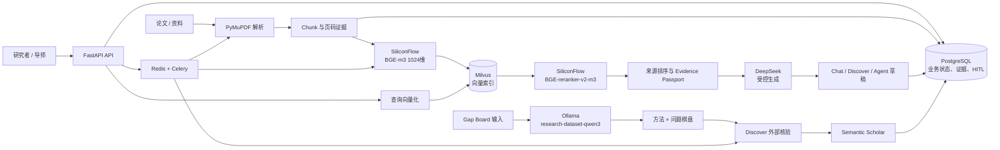

# GapMind 模型与服务清单（T2-01 初稿）

**状态**：初稿，代码新增认证/解析质量字段；版本/数据快照待最终冻结
**制定日期**：2026-08-24
**适用分支**：`yx_dev`
**主学科**：计算机科学—图机器学习/图神经网络
**对应任务**：T2-01 建立模型与服务清单

本文档根据当前配置、网关和服务代码整理。它回答“哪个模型/服务负责什么”，不等同于模型卡，也不证明真实外部服务持续可用。服务版本、模型 digest、数据哈希和运行记录需要在 T2-02～T5-02 冻结。

## 版本证据快照（本机只读采样）

以下版本由当前工作区的后端虚拟环境、依赖文件、Compose 配置和前端运行时采样得到；它们不是外部模型服务的在线健康证明，也不替代提交时的 checksum。

| 层 | 采样结果 | 证据来源 |
|---|---|---|
| Python | `3.11.4` | `backend/.venv` 运行时 |
| FastAPI / Pydantic | `0.115.0` / `2.9.2` | 已安装包；`backend/requirements.txt` 固定 |
| SQLAlchemy / Alembic | `2.0.35` / `1.13.2` | 已安装包；`backend/requirements.txt` 固定 |
| Celery / Redis client | `5.4.0` / `5.0.8` | 已安装包；`backend/requirements.txt` 固定 |
| PyMilvus | `2.4.6` | 已安装包；requirements 为 `>=2.4.6` |
| HTTP / OpenAI client | `httpx 0.27.2` / `openai 1.51.0` | 已安装包；requirements 固定 |
| PyMuPDF | `1.24.10` | 已安装包；requirements 固定 |
| Node / npm | `v24.14.0` / `11.9.0` | 前端工作区运行时 |
| Compose images | `postgres:15-alpine`、`redis:7-alpine`、`milvusdb/milvus:v2.4.4` | `infra/docker-compose.yml` |

模型配置采样结果为：`deepseek-v4-flash`、`BAAI/bge-m3`（1024 维）、`BAAI/bge-reranker-v2-m3`、`research-dataset-qwen3:run7-q8-templatefix`；`GAP_EXTRACTOR_MODEL_DIGEST` 为空，远程 Gap 抽取默认关闭。上述模型 ID 已确认，权重文件、服务端 build、digest 和调用日期仍待冻结。

## 一、评委可读摘要

GapMind 不是让一个模型独立完成科研判断，而是将不同职责拆开：

1. 通用生成模型负责受控的问答、归纳、研究机会候选、Critic 和计划/代码草稿；
2. BGE-m3 负责论文片段的向量化，Milvus 负责向量召回；
3. BGE reranker 负责二阶段相关性排序；
4. `research-dataset-qwen3` 只负责研究空白棋盘的结构化抽取/标注，不作为最终通用生成模型口径；
5. Semantic Scholar 提供外部论文元数据与开放全文线索；
6. PostgreSQL、Redis/Celery 和 Milvus 分别保存业务状态、异步任务状态和向量索引。

## 二、模型与外部服务总表

| 类别 | 当前服务/模型 ID | 主要用途 | 代码入口 | 部署/网络位置 | 当前回退与限制 | 版本状态 |
|---|---|---|---|---|---|---|
| 通用生成 | `deepseek-v4-flash` | Workspace Chat、Discover、Critic、计划/代码草稿等受控文本生成 | `backend/app/gateway/llm.py` | DeepSeek OpenAI 兼容 API | 可选备用 OpenAI 兼容端点；仅在 key/base URL/model 三项齐全时启用 | 模型 ID 已记录；服务快照未冻结 |
| 备用生成 | `DEEPSEEK_BACKUP_MODEL` | 主 LLM 失败后的单次降级 | 同上 | 用户配置的 OpenAI 兼容端点 | 流式调用只允许在首块前切换；备用端点失败后抛出主错误 | 默认未启用 |
| 向量模型 | `BAAI/bge-m3` | 论文/Chunk 向量化与语义召回 | `backend/app/gateway/embedding.py` | SiliconFlow OpenAI 兼容 API | Embedding 不可用时检索链路失败闭环，不伪造来源 | 1024 维已记录；服务版本未冻结 |
| 重排模型 | `BAAI/bge-reranker-v2-m3` | 对 Milvus 召回候选做 cross-encoder 二阶段排序 | `backend/app/gateway/reranker.py` | SiliconFlow `/v1/rerank` | 重排失败时返回向量召回结果并标记 `reranker_degraded` | 模型 ID 已记录；服务版本未冻结 |
| 研究空白抽取 | `research-dataset-qwen3:run7-q8-templatefix` | Gap Board 的方法/问题结构化抽取与校验修复 | `backend/app/gateway/gap_extractor.py` | Ollama `127.0.0.1:11434`；开发机通过 SSH 隧道访问服务器 | 本地 Ollama 隧道不可用时失败；可选远程备份必须同时开启 feature flag 和单次材料外发同意 | 模型 ID 已记录；digest 为空，待冻结 |
| 远程抽取备份 | `GAP_EXTRACTOR_REMOTE_MODEL` | Gap 抽取服务异常时的显式远程结构化备份 | 同上 | 用户配置的 OpenAI 兼容端点 | 默认关闭；必须显式配置、启用并取得材料传输同意 | 默认未启用 |
| 外部论文服务 | Semantic Scholar Academic Graph API | 外部新颖性核验、论文检索、元数据和开放全文下载 | `backend/app/gateway/semantic_scholar.py` | `https://api.semanticscholar.org/graph/v1` | Redis 缓存、请求槽位、429 重试；外部失败需显示失败/部分成功状态 | API 版本由 endpoint 定义；运行可用性未冻结 |
| 业务数据库 | PostgreSQL 15（部署目标） | Workspace、论文、知识、Discover、Agent、Chat、HITL 等业务状态 | `backend/app/db/`、Alembic | 本地 Compose `127.0.0.1:5432` | 数据库不可用时服务不可就绪；代码新增 Workspace/Chat/搜索私有资源 `owner_id` 和 PDF 质量字段，迁移 head 为 `0028_search_acl` | 容器目标版本已记录；实例和迁移升级待复核 |
| 向量数据库 | Milvus 2.4（部署目标） | 论文 Chunk 的 1024 维向量索引与检索 | `backend/app/domains/retrieval/milvus_client.py` | 本地 Compose `127.0.0.1:19530`，依赖 etcd/MinIO | Milvus/索引不可用时检索失败闭环；不返回无来源答案 | 容器目标版本已记录；collection 快照待冻结 |
| 缓存/队列 | Redis 7 + Celery 5（部署目标） | S2 缓存、限流槽位、PDF/抽取/Embedding/Agent 异步任务 | `backend/app/core/semantic_scholar_control.py`、`backend/app/workers/` | 本地 Compose `127.0.0.1:6379`；Windows worker 使用 solo 池 | Redis/worker 不可用时显示任务或外部服务故障，不伪装完成 | 组件目标版本已记录；运行时版本待复核 |
| PDF 解析 | PyMuPDF / `fitz` | PDF 文本、页码和证据片段解析 | `backend/app/domains/artifact/`、`backend/app/workers/tasks/parse_pdf.py` | 后端本地执行 | 解析失败必须保留失败原因；解析文本中的 NUL 字节需清理 | 依赖版本待提交时冻结 |

## 三、数据流与模型职责



## 四、核心链路说明

### 4.1 Workspace Chat

```text
用户问题
  → BGE-m3 查询向量
  → Milvus dense recall
  → BGE reranker 二阶段排序
  → 论文证据与来源类型校验
  → DeepSeek 受控生成
  → [En] 引用一致性检查
  → 有证据回答 / 证据不足时 fail closed
```

当前生产 Chat 链路是 dense retrieval + reranker，不应表述为已经上线 GraphRAG。`[En]` 论文证据、`[Pn]` 计划、`[Dn]` 报告、`[Cn]` 代码草稿必须严格区分。

### 4.2 Discover 与研究计划

```text
Workspace 证据
  → Planner 拆分研究轴
  → Evidence 查询支持与反证
  → Semantic Scholar 外部检索
  → Opportunity 形成候选
  → Critic keep / narrow / reject
  → Evidence Gate 检查独立全文和覆盖
  → 用户 HITL 确认
  → 研究计划 / 代码草稿
```

DeepSeek 在这里负责候选、归纳和草稿；它不能自动完成新颖性判断。外部查询有缓存、实时、部分成功和失败状态，不能把缓存或部分成功说成完整实时核验。

### 4.3 Gap Board

```text
论文文本
  → Ollama 上的 research-dataset-qwen3
  → 方法 / 问题实体和结构化标注
  → Schema 校验与有限修复
  → 方法 × 问题棋盘
  → 未确认格交给 Discover 做证据与新颖性核验
```

该模型是垂类抽取/标注组件。当前材料应使用“垂类抽取模型 + 领域知识证据 + 受控研究工作流”的准确口径，不能把它包装成最终生成模型已经完成图机器学习领域 SFT。

## 五、调用约束与失败降级

| 链路 | 正常状态 | 失败/降级状态 | 用户必须看见的事实 |
|---|---|---|---|
| LLM 主端点 | 使用配置的 DeepSeek 模型生成 | 备用端点仅在三项配置齐全时尝试一次 | 当前答案使用哪个模型/是否发生 fallback |
| 结构化 LLM 调用 | `disable_thinking=True` | 不与 `reasoning_effort` 同时传递 | 结构化输出失败时保留失败原因，不把空结果当成功 |
| Embedding | BGE-m3 生成 1024 维向量 | 不可用时检索不可继续或显示可解释错误 | 资料未完成向量化时不能声称可检索 |
| Milvus | dense recall | collection/连接/索引故障时 fail closed | 不返回没有来源的补写答案 |
| Reranker | BGE reranker 排序 | 降级为向量召回，标记 `reranker_degraded` | 用户知道排序质量链路不完整 |
| Semantic Scholar | 搜索/精确查找/开放全文 | 缓存、429 重试、部分成功或失败 | 结果是实时、缓存、部分成功还是失败 |
| Gap Board 抽取 | Ollama 本地隧道服务 | 隧道断开、模型 404、超时或 Schema 校验失败 | 显示需要检查 SSH 隧道/服务器模型，不静默生成棋盘 |
| Celery | 异步任务执行 | Redis/worker 不可用、任务失败或超时 | 任务状态、失败原因和是否可重试 |

项目级 LLM 约束：生成调用统一使用 `disable_thinking=True`，不得同时传 `reasoning_effort`；改动调用链时需要同步检查同步和 SSE/流式路径。

## 六、数据去向与安全边界

1. API key 只保留在后端配置，前端不接触 DeepSeek、SiliconFlow 或 Semantic Scholar 凭据。
2. 论文文本和用户问题可能进入远程 LLM、Embedding 或 Semantic Scholar 相关链路；真实敏感材料在上传前必须脱敏，并在产品中提示数据去向。
3. Gap Board 默认访问 SSH 隧道后的 Ollama。开发机不要启动本地 Ollama 占用 `127.0.0.1:11434`，否则会遮蔽服务器模型隧道。
4. 远程 Gap 抽取默认关闭；只有服务端开关、远程配置和单次材料外发同意同时满足时才允许发送材料。
5. PostgreSQL、Milvus、Redis、MinIO 和 etcd 的本地 Compose 端口当前绑定到 `127.0.0.1`；公开 Demo 前仍需补齐认证、Workspace ACL、CORS、上传限制和日志脱敏。

## 七、版本与证据冻结清单

当前已经有明确 ID 或目标版本的项目：

- LLM：`deepseek-v4-flash`；
- Embedding：`BAAI/bge-m3`，1024 维；
- Reranker：`BAAI/bge-reranker-v2-m3`；
- Gap Board：`research-dataset-qwen3:run7-q8-templatefix`；
- 迁移：`0025_workspace_owner_acl`、`0026_paper_parse_quality`、`0027_chat_conversation_owner`、`0028_search_acl`（分别覆盖 Workspace owner、PDF 解析质量、Chat 对话 owner、搜索历史/收藏 owner 隔离；已确认 Alembic head，真实数据库升级结果待 staging 复核）；
- 目标基础设施：PostgreSQL 15、Milvus 2.4、Redis 7、Celery 5；
- 代码审查起始基线：后端 469 个测试通过；当前候选工作区：后端 481 个测试通过、前端 56 个测试通过；两者属于不同时间点，最终提交前需重新执行并记录。

提交前仍必须补齐：

- [ ] `GAP_EXTRACTOR_MODEL_DIGEST` 或等价模型 digest；
- [ ] DeepSeek、SiliconFlow、Semantic Scholar 实际服务/模型版本和采集日期；
- [ ] Python、Node、PostgreSQL、Milvus、Redis、Celery、PyMuPDF 的实际运行时版本；
- [ ] Prompt、Schema、解析器版本；
- [ ] Demo 论文集、抽取结果、Chunk、Milvus collection 和 Gold 的哈希；
- [ ] 所有远程服务的授权、数据去向和离线 fallback 记录。
- [ ] staging/production 的 `AUTH_TOKENS`、跨用户 Workspace ACL 和 `/health/ready` Smoke Test 结果；
- [ ] PDF 上传 magic/大小/Workspace 配额边界和解析质量字段的真实样例。

## 八、T2-02 前的准确口径

建议提交材料使用以下表述：

> GapMind 采用通用生成模型完成受控的科研问答、机会候选和计划/代码草稿生成；采用 BGE-m3 与 reranker 建立论文证据检索链路；采用 `research-dataset-qwen3` 作为研究空白棋盘的垂类抽取/标注组件，并通过 Evidence Passport、Critic、Evidence Gate 和 HITL 将模型输出限制在可追溯、可审阅的科研流程中。

不要使用以下未经冻结证据支撑的表述：

- “最终生成模型已经完成图机器学习领域 SFT”；
- “系统已经是生产级 GraphRAG”；
- “所有外部模型服务持续稳定可用”；
- “代码已经执行并复现了实验结果”；
- “系统已经支持高校级多租户和大规模商业化”。

## 九、验收记录

- [x] 已记录生成、Embedding、Reranker、Gap Board、Semantic Scholar、数据库、向量库和队列的职责。
- [x] 已记录主要入口、网络位置、数据流和失败降级方向。
- [x] 已区分垂类抽取模型与通用生成模型。
- [ ] 服务运行时版本、模型 digest、数据快照和 prompt/schema 版本待 T2-02～T5-02 冻结。
- [ ] 真实外部服务连通性和持续稳定性待 T3-05/T3-06 验证。
